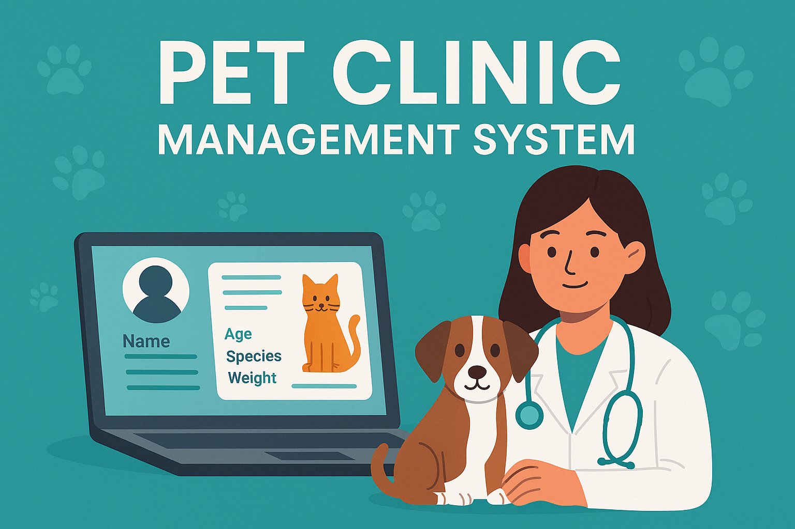

# Sistema de Gerenciamento de Pets para Clínicas Veterinárias



Uma solução prática e funcional para clínicas que prezam pelo cuidado e organização no atendimento aos seus clientes e seus animais.

---

## Sobre o Projeto

Este sistema é uma aplicação enxuta desenvolvida com Laravel, ideal para o dia a dia de clínicas veterinárias. Permite gerenciar informações de clientes, animais de estimação e atendimentos de forma prática e centralizada.

---

## Funcionalidades

* Cadastro de Clientes: nome completo, telefone, e-mail, CPF, endereço, entre outros.
* Cadastro de Animais: nome, idade, espécie, raça, peso e características gerais.
* Registro de Consultas: descrição do procedimento, data, observações.
* Vínculo entre clientes e seus respectivos animais.
* Histórico completo de atendimentos e agendamentos realizados.

---

## Como Instalar

Antes de começar, certifique-se de ter instalado:

* [PHP 8.4 ou superior](https://www.php.net/downloads.php)
* [Docker](https://www.docker.com/get-started)
* [Composer](https://getcomposer.org/)
* [Laravel Sail](https://laravel.com/docs/12.x/sail)

1. Clone este repositório:

```bash
git clone https://github.com/ilyvitorialuz/petshop.git
cd petshop
```

2. Instale as dependências e configure o ambiente:

```bash
composer install
cp .env.example .env
./vendor/bin/sail up -d
./vendor/bin/sail artisan key:generate
```

3. Configure seu `.env` com os dados do banco de dados, se necessário:

```env
DB_CONNECTION=mysql
DB_HOST=127.0.0.1
DB_PORT=3306
DB_DATABASE=clinica_pets
DB_USERNAME=root
DB_PASSWORD=
```

4. Execute as migrations:

```bash
./vendor/bin/sail artisan migrate
```

5. (Opcional) Insira dados de exemplo no banco:

```bash
./vendor/bin/sail artisan db:seed
```

6. (Opcional) Crie um usuário administrador para acessar o painel do Filament:

```bash
./vendor/bin/sail artisan make:filament-user
```

7. Acesse a aplicação:

```
http://localhost
```

---

## Reconhecimentos

Este projeto foi idealizado a partir das rotinas e necessidades de clínicas veterinárias. Agradecemos à comunidade Laravel e aos desenvolvedores das ferramentas utilizadas, cuja contribuição tornou este projeto possível.

---

## Fale Conosco

Tem dúvidas, sugestões ou quer colaborar? Entre em contato com a equipe de desenvolvimento:

* Coordenação do Projeto:

  * Nome: Ily Vitória da Luz Soares

* Desenvolvimento Back-End:

  * Nome: João Gabryel Dias Santos

* Desenvolvimento Front-End:

  * Nome: Ana Beatriz Nascimento Resplandes de Araújo
